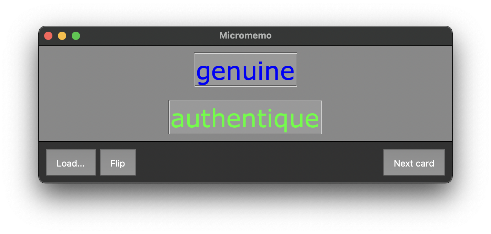

# Micromemo



*Micromemo* is a minimal text-only flashcard application made in *Python* using *tkinter*.

## Install

You need:

- Python 3.9.5 (I didn't test it on earlier versions but it probably works for any Python 3.X)
- *tkinter*

Then run `python3 main.py`. If you have any trouble installing or running the application, please raise an issue.

## How it works

The learning algorithm is very simple: it samples a card from the deck uniformly, making sure it does not show the same card twice. The following code shows (almost literally, see `script/model.py`) how cards are sampled.

```python
previous_card = current_card

while (current_card == previous_card):
  current_card = random.randint(1, self.count())
```

No complicated and unpredictable spaced repetitions, sampling is just random.

## Decks

There is an example deck in the `deck` folder which is called `french-adjectives.csv`. Here is an excerpt.

```csv
confident,confiant
obnoxious,insupportable
navy,bleu marine
heavy,lourd
amazed,étonné
due,approprié
```

This is a plain `.csv` file with two columns. It can be loaded from *Micromemo* by clicking on the  `Load...` button. Use the editor of your choice to create your own decks.